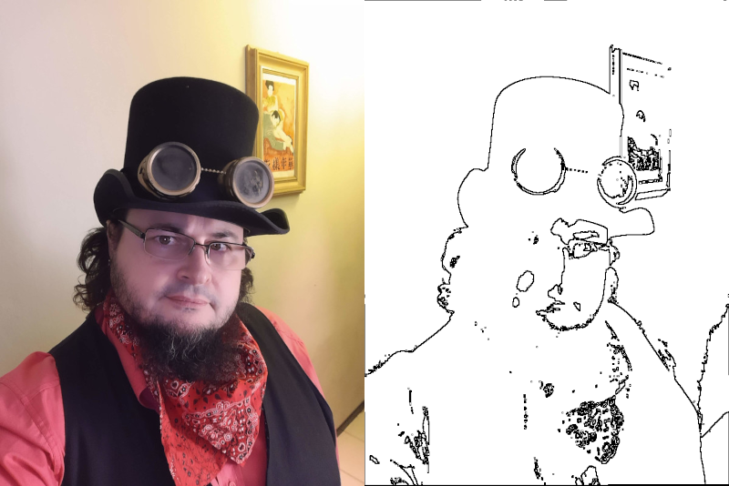

# Edge Detection

Edge Detection is a program for detecting edges in images, implementing several classic algorithms (Roberts, Sobel, etc.), as well as neural network approaches and algorithms proposed by the author. The project allows visual and runtime comparison of the efficiency of these methods.

## Project Background

This work was initially developed during the Computational Vision course of Professor Aldo von Wangenheim at the Postgraduate Program in Computer Science (PPGCC) at the Federal University of Santa Catarina (UFSC) in the second semester of 2001. In the course, I implemented a program that performed edge detection in an image using an Artificial Neural Network with Backpropagation learning.

Link to the original course work: [https://www.inf.ufsc.br/~aldo.vw/visao/2001/saulo/]

Later, in 2005, during my doctorate in the Postgraduate Program in Automation and Systems Engineering (PPGEAS) at the same university, I proposed another algorithm for edge detection that used only conditionals (single and double). I wrote an article with the help of my doctoral colleague Rui Jorge Tramontin entitled "Proposal for Optimization of Edge Detection Algorithms in Images," which was accepted as a poster for presentation at the "4th International Information and Telecommunication Technologies Symposium" in 2005.



For the article, I implemented the Roberts (and variant) and Sobel (and variant) edge detection techniques, used the neural network edge detection already implemented in Professor Aldo's course, implemented the algorithm using only one perceptron, and proposed the Single Conditional and Double Conditional algorithms. The article presents a visual and runtime comparison of the algorithms.

The paper and poster presented are in the `doc` folder.

## Installation

Make sure you have `clang++`, `make`, `libsdl2-dev`, and `libsdl2-image-dev` installed on your system.

To build the project, run:

```sh
make
```

## Usage

To run the edge detection program:

```sh
./edge <image_file> <algorithm>
```

To train the perceptron network:

```sh
./train
```

Check the documentation or source code for details on command-line parameters and available algorithms.

## Runtime Comparison

The results below are from the time the article was written.

### Runtime Environment

* Computer: Pentium IV 3GHz, 1GB RAM
* Operating System: Linux
* Programming Language: C
* Original image resolution: 2048x2560 pixels
* Execution time measured on: October 05, 2005

### Runtime Results

| Algorithm   |   1st  |   2nd |   3rd | Average |
| :---------- | -----: | ----: | ----: | ------: |
| Roberts     |  0.60  | 0.60  | 0.60  |  0.60   |
| RobertsAbs  |  0.10  | 0.09  | 0.10  |  0.09   |
| Sobel       |  0.64  | 0.64  | 0.65  |  0.64   |
| SobelAbs    |  0.15  | 0.15  | 0.16  |  0.15   |
| Backprop    | 19.39  |19.49  |19.48  | 19.48   |
| Perceptron  |  1.05  | 1.06  | 1.05  |  1.05   |
| If          |  0.06  | 0.06  | 0.06  |  0.06   |
| Double If   |  0.08  | 0.08  | 0.08  |  0.08   |

## Considerations and Modifications

* The original code was developed in C using the Allegro library and could only work with BMP images. For publishing on GitHub, I made some recent changes (June 10, 2021).
* To use a Multilayer Perceptron with Backpropagation, I used QwikNet V2.23 software at the time, which generates C code to run the network. Although I have my own implementations of Multilayer Perceptron Artificial Neural Networks today, for this program I kept the same resource used at the time.
* I switched to the Simple DirectMedia Layer 2 (SDL2) library to support other image formats.
* Each filter was originally coded in a separate program and much code was rewritten. I unified all filters into a single program, selecting the filter via command-line parameter.
* I updated the test image to a more recent and "much prettier" one.

## License

[Specify your license here, e.g.,